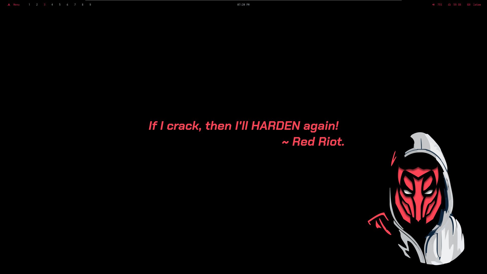
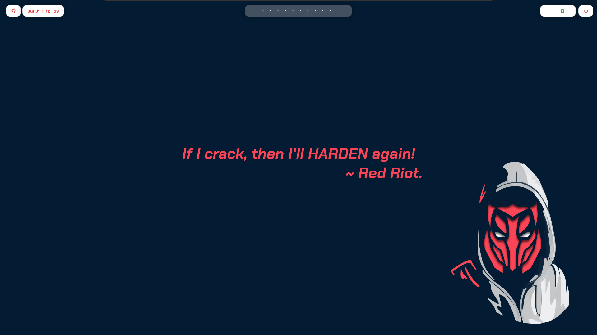

# Hacking Startup

The idea of this repo is to execute a script that setups all my needed tools and
configurations for my Penetration testing OS (either Kali or Parrot).

# How to Install

Just run the following command:
```shell
bash ./startup.sh
```

## Red Obsidian (My default One)



## Minimal Bspwm


